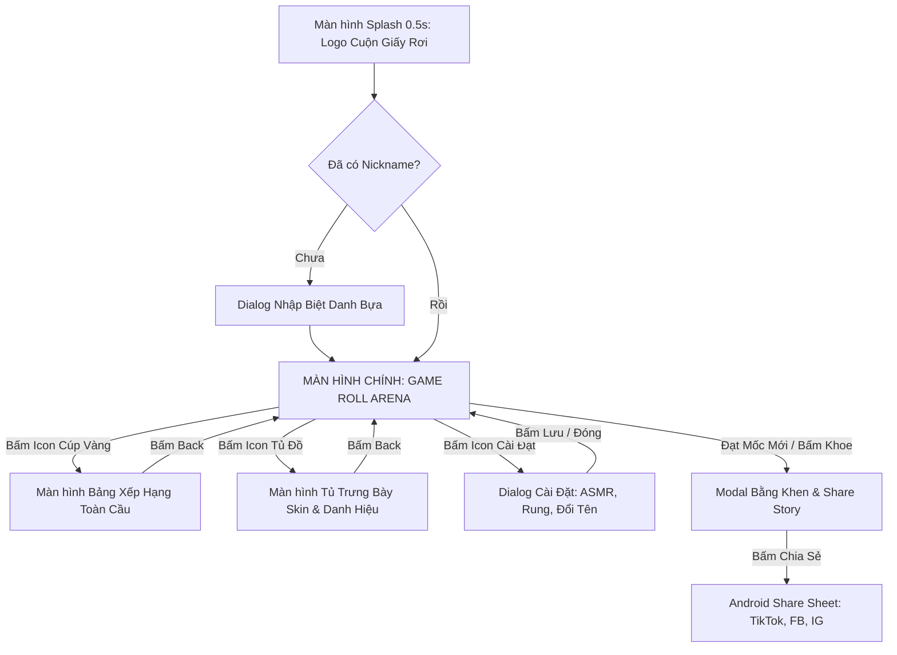
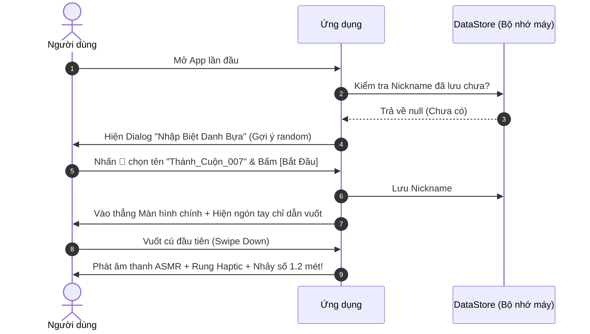
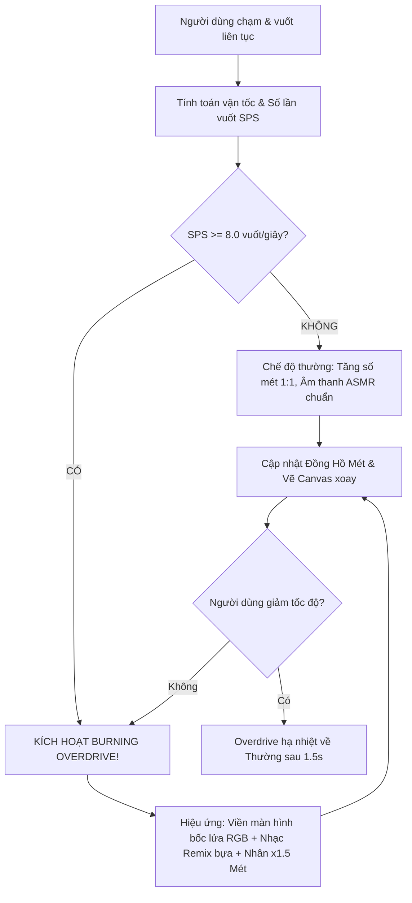
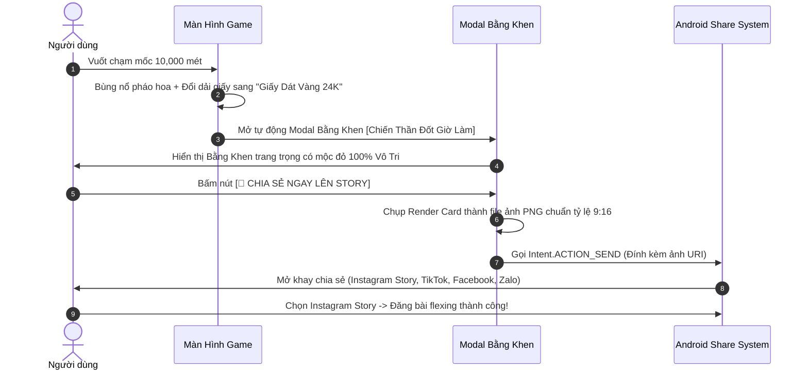
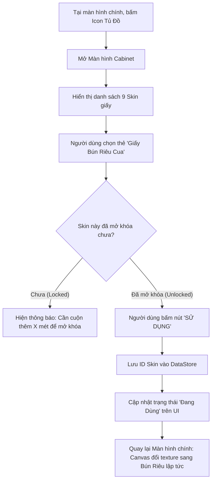

# 📜 TÀI LIỆU PHÂN TÍCH & THIẾT KẾ SẢN PHẨM CHI TIẾT
## DỰ ÁN: "SCROLL & SCROLL - CUỘN GIẤY VỆ SINH VÔ TẬN"
*(Tên tiếng Anh: Endless Toilet Paper - The Absurdist Doomscroll Game for Gen Z)*

---

## MỤC LỤC
1. [BỐI CẢNH, TÂM LÝ NGƯỜI DÙNG & TIỀM NĂNG VIRAL](#1-bối-cảnh-tâm-lý-người-dùng--tiềm-năng-viral)
2. [THIẾT KẾ CORE GAMEPLAY & CƠ CHẾ VẬT LÝ CUỘN](#2-thiết-kế-core-gameplay--cơ-chế-vật-lý-cuộn)
3. [HỆ THỐNG TIẾN HÓA SKIN, DANH HIỆU & BẰNG KHEN VIRAL](#3-hệ-thống-tiến-hóa-skin-danh-hiệu--bằng-khen-viral)
4. [THIẾT KẾ DESIGN SYSTEM & QUY CHUẨN UI COMPONENTS](#4-thiết-kế-design-system--quy-chuẩn-ui-components)
5. [THIẾT KẾ CHI TIẾT CÁC MÀN HÌNH (DETAILED SCREENS WIREFRAMES)](#5-thiết-kế-chi-tiết-các-màn-hình-detailed-screens-wireframes)
6. [KIẾN TRÚC ĐIỀU HƯỚNG & QUY TẮC NAVIGATION](#6-kiến-trúc-điều-hướng--quy-tắc-navigation)
7. [SƠ ĐỒ LUỒNG THAO TÁC CHI TIẾT (USER FLOWCHARTS)](#7-sơ-đồ-luồng-thao-tác-chi-tiết-user-flowcharts)
8. [HỆ THỐNG ÂM THANH ASMR & PHẢN HỒI XÚC GIÁC (HAPTICS)](#8-hệ-thống-âm-thanh-asmr--phản-hồi-xúc-giác-haptics)
9. [BẢNG XẾP HẠNG & TÍNH NĂNG CỘNG ĐỒNG TOÀN CẦU](#9-bảng-xếp-hạng--tính-năng-cộng-đồng-toàn-cầu)
10. [CHI TIẾT CÁC USE-CASE NGƯỜI DÙNG (USER SCENARIOS)](#10-chi-tiết-các-use-case-người-dùng-user-scenarios)
11. [CHIẾN LƯỢC MONETIZATION & ASO CH PLAY](#11-chiến-lược-monetization--aso-ch-play)

---

## 1. BỐI CẢNH, TÂM LÝ NGƯỜI DÙNG & TIỀM NĂNG VIRAL

### 1.1. Hiện tượng "Doomscrolling" & Sự Thật Ngầm Hiểu (Consumer Insight)
- **Thực trạng**: Hàng triệu bạn trẻ Gen Z có thói quen mở TikTok, Reels, Shorts và lướt vô thức hàng giờ liền. Não bộ khao khát dopamine vi mô từ mỗi cú vuốt, ngón tay hình thành phản xạ cơ học lặp đi lặp lại.
- **Insight cốt lõi**: *"Tôi biết mình đang lướt vô bổ và đốt thời gian, nhưng ngón tay tôi không muốn dừng lại vì hành vi vuốt mang lại sự giải tỏa căng thẳng (stress relief) tức thì."*
- **Định vị sản phẩm (Product Positioning)**: **Anti-Productivity / Absurdist Satire Game (Game châm biếm vô tri)**. 
  - Ứng dụng không cố gắng làm người dùng cảm thấy tội lỗi hay ngăn cản họ lướt.
  - Ngược lại, app tôn vinh hành vi đó: *"Nếu bạn đã muốn lướt trong vô vọng, hãy lướt cuộn giấy vệ sinh 999.999 km này và trở thành Vua Cuộn Giấy Thế Giới!"*.

### 1.2. Công Thức Viral (Viral Loops)
```
+-------------------------------------------------------------+
| 1. Người dùng vuốt cuộn giấy liên tục (Thỏa mãn ASMR)       |
+-------------------------------------------------------------+
                              |
                              v
+-------------------------------------------------------------+
| 2. Đạt mốc km -> Mở khóa Bằng Khen "Cà Khịa" Siêu Hài       |
+-------------------------------------------------------------+
                              |
                              v
+-------------------------------------------------------------+
| 3. Xuất ảnh Bằng Khen 1 chạm -> Share lên TikTok / Story    |
+-------------------------------------------------------------+
                              |
                              v
+-------------------------------------------------------------+
| 4. Bạn bè tò mò tải app -> Cạnh tranh Đua Top Leaderboard   |
+-------------------------------------------------------------+
```

---

## 2. THIẾT KẾ CORE GAMEPLAY & CƠ CHẾ VẬT LÝ CUỘN

### 2.1. Vòng lặp Trò chơi Cốt lõi (Core Game Loop)
1. **Thao tác (Action)**: Người dùng chạm ngón tay và vuốt xuống (hoặc vuốt xoay).
2. **Phản hồi tức thì (Immediate Feedback)**:
   - Cuộn giấy xoay tròn quanh trục, dải giấy rơi xuống kéo dài miên man.
   - Âm thanh ASMR xột xoạt giòn rụm + Haptic rung nhẹ theo từng mắt giấy.
   - Đồng hồ đo mét nhảy số liên tục theo thời gian thực.
3. **Tích lũy & Thăng hoa (Progression & Rush)**:
   - Vuốt nhanh kích hoạt **Chế độ Overdrive** (Cuộn giấy bốc lửa / RGB + Âm nhạc remix).
   - Tích lũy đủ mét $\rightarrow$ Tự động biến đổi **Skin Giấy** $\rightarrow$ Trao **Bằng Khen Bựa**.
4. **Cạnh tranh (Social Competition)**: Đẩy điểm lên **Bảng xếp hạng Toàn Cầu & Đại chiến Quốc gia**.

### 2.2. Cơ chế Vật Lý & Cảm Giác Ngón Tay (Physics & Touch Mechanics)
- **Chế độ Vuốt Kéo (Direct Drag)**: Giấy bám theo ngón tay chính xác tỉ lệ 1:1 khi ngón tay đang chạm màn hình.
- **Chế độ Vuốt Văng Quán Tính (Fling / Inertia Physics)**:
  - Khi người dùng vuốt nhanh rồi thả tay, cuộn giấy sẽ tiếp tục quay tự do với vận tốc ban đầu và giảm tốc dần theo ma sát không khí mô phỏng.
- **Công thức quy đổi Khoảng Cách**:
  - $1\text{ pixel}$ vuốt dọc $\approx 0.05\text{ cm}$ giấy.
  - $1\text{ cú vuốt toàn màn hình } (\approx 2000\text{px}) \approx 1\text{ mét}$ giấy.
  - **Mục tiêu tối thượng**: Đạt mốc **$999.999\text{ km}$** (Tương đương cuộn giấy đi vòng quanh Trái Đất 25 lần!).

### 2.3. Hệ thống Tốc độ Vuốt (SPS Meter & Overdrive Mode)
- **SPS (Swipes Per Second)**: Đo lường số cú vuốt thực hiện trong 1 giây qua cửa sổ trượt (sliding window 1.0s).
- **Các tầng trạng thái Combo**:
  - **0 - 3 SPS (Chill Mode)**: Âm thanh sột soạt nhẹ nhàng, giấy trôi êm đềm.
  - **4 - 7 SPS (Turbo Mode)**: Cuộn giấy quay vù vù, xuất hiện làn gió xoáy nhẹ 2 bên.
  - **$\ge 8$ SPS (BURNING OVERDRIVE)**:
    - Cuộn giấy bốc lửa hoặc phát sáng cầu vồng RGB.
    - Âm thanh chuyển sang điệu nhạc disco/remix siêu bựa tăng tốc.
    - Hệ số nhân điểm: **x1.5 mét** trong suốt thời gian duy trì Overdrive.

### 2.4. Các Sự Kiện Bất Ngờ "Vô Tri" (Random In-game Events)
- **Kẹt Giấy (Paper Jam - 1% xác suất ngẫu nhiên)**: Cuộn giấy khựng lại, có tiếng "kíttttt". Người dùng cần gõ nhanh 3 lần liên tiếp vào cuộn để gỡ kẹt.
- **Ruồi / Muỗi Sa Lưới**: 1 chú ruồi hoạt họa bỗng dưng đậu lên dải giấy đang rơi. Nếu bấm trúng chú ruồi $\rightarrow$ Nhận ngay bonus **+100m** giấy miễn phí.
- **Cơn Gió Lốc Bất Ngờ**: Tự động thổi cuộn giấy quay tít mù trong 3 giây.

---

## 3. HỆ THỐNG TIẾN HÓA SKIN, DANH HIỆU & BẰNG KHEN VIRAL

### 3.1. Cây Tiến Hóa 20 Cấp Độ Skin Cuộn Giấy: "Hành Trình Từ Vô Tri Đến Tâm Thần"
Mỗi skin không chỉ thay đổi màu sắc mà thay đổi toàn bộ họa tiết dải giấy, hiệu ứng hạt rơi (particles) và âm thanh ASMR riêng biệt:

| Cột mốc Mét | Tên Skin Cuộn Giấy (Chủ Đề) | Thiết Kế Dải Giấy & Hiệu Ứng Rơi (VFX/SFX) | Tên Bằng Khen / Danh Hiệu | Lời Phê Cà Khịa Trào Phúng |
| :--- | :--- | :--- | :--- | :--- |
| **0 m** | **Giấy Xám Trọ Sinh Viên** | (Mặc định) Xám xịt, lấm tấm đen, rớt vụn giấy mủn, tiếng sột soạt rẻ tiền. | *(Chưa có)* | *(Chưa có)* |
| **36 m** | **Giấy Rau Má Thanh Hóa** | Xanh lá dập vân, rớt icon lá rau má `🍃`, tiếng "hút rột rột". | **Đồng Hương Tập Sự 🍃** | *"Vuốt mới được 36 mét đã đòi giải khát. Lo mà cày tiếp đi!"* |
| **100 m** | **Giấy Báo Gói Xôi Xéo** | Giấy báo ố vàng lốm đốm mỡ, in tin giật gân, rơi hột xôi vàng `🌾`. | **Tấm Chiếu Mới Mua 📰** | *"Hết 100m rồi, đủ thời gian để bạn nhai xong gói xôi 10 ngàn trước cửa công ty đấy."* |
| **404 m** | **Giấy "Còn Cái Nịt"** | Giấy trong suốt tàng hình, thi thoảng dính 1 sợi dây thun (nịt) vàng/đỏ `🟡`. | **Kẻ Mất Tất Cả 🪢** | *"Lỗi 404: Ý nghĩa cuộc đời Not Found! Tầm này vuốt nữa thì cũng... còn đúng cái nịt!"* |
| **1,000 m** | **Giấy Tiền Đô La ($100)** | Xanh bạc hà, in hình tờ 100 đô, tiếng máy đếm tiền ngân hàng "tách tách" `💵`. | **Phú Ông Ảo Mộng 💵** | *"Giàu quá! Tiếc là tiền này chỉ mang xuống Âm Phủ mua được bát bún riêu thôi."* |
| **3,000 m** | **Giấy Iron Man (I love u 3000)** | Đỏ vàng kim loại bóng bẩy, rớt lò phản ứng hồ quang `☢️`, nhạc bi tráng. | **Kẻ Lụy Tình Vũ Trụ 💔** | *"I love you 3000... Nhưng crush của bạn thì love người khác mất rồi. Khóc đi!"* |
| **8,386 m** | **Giấy Sổ Đỏ Phân Lô** | Đỏ chót, có họa tiết Quốc huy chìm, rớt mấy cái cọc cắm đất "Đã Bán" `📑`. | **Trùm Phông Bạt Thổ Cư 🏗️** | *"Trên mạng thì vuốt sổ đỏ 8386 ầm ầm, check tài khoản ngân hàng thì số dư 45k."* |
| **15,000 m** | **Giấy Mì Tôm Chua Cay** | Màu hồng cam dập nổi vân vắt mì xoăn, rớt hạt muối Hảo Hảo đỏ rực `🍜`. | **Đại Sứ Ăn Liền 🍜** | *"Vuốt đến mức lòi cả mì tôm ra. Đêm nay lại ăn mì úp nước sôi chứ gì? Khổ thân!"* |
| **25,000 m** | **Giấy Khoan Cắt Bê Tông** | Tường vàng lở loét in chi chít chữ xanh/đỏ "Rút hầm cầu", "Khoan cắt... 09xx" `🧱`. | **Đại Sứ Quy Hoạch Đô Thị 🚜** | *"Ngón tay bạn đi tới đâu, mĩ quan đô thị bị tàn phá tới đó. Alo rút hầm cầu không?"* |
| **42,000 m** | **Giấy Dán Salonpas** | Dải giấy cao su màu da người, xanh lợt, tỏa khói the mát (bạc hà) `🩹`. | **VĐV Thoái Hóa Cột Sống 🩻** | *"42km là cự ly Marathon đấy! Kỷ lục gia vuốt điện thoại đến mức đau vai gáy là đây."* |
| **69,420 m** | **Giấy Check VAR Sao Kê** | Dải A4 trắng tinh, in chi chít số tài khoản dài ngoằng, có vệt bút dạ quang đỏ `📊`. | **Kiểm Toán Viên Chạy Pin 🔍** | *"Vuốt dài thế này đã kiếm ra được trang sao kê của người donate 2 nghìn chưa bạn?"* |
| **100,000 m** | **Giấy Hóa Đơn Tiền Điện** | Giấy in nhiệt dài dằng dặc, in toàn số tiền tỷ, mép giấy hình răng cưa `⚡`. | **Nạn Nhân Của Mùa Hè 🧾** | *"Càng lướt cái bill càng dài. Giật mình nhớ ra tháng này chưa đóng tiền điện đúng không?"* |
| **150,000 m** | **Giấy Thiệp Cưới Đỏ Chót** | Đỏ nhung có chữ Hỷ 囍 mạ vàng, rớt phong bì tiền mừng `✉️`. | **ATM Di Động Mùa Cưới 💌** | *"Cuốn giấy này đại diện cho danh sách bạn bè mời cưới tháng này. Tháng này húp mì nhé!"* |
| **222,222 m** | **Giấy Đơn Xin Nghỉ Việc** | Giấy A4 kẻ ngang, dòng chữ "TÔI QUÁ MỆT MỎI" lặp đi lặp lại `📝`. | **Anh Hùng Chốn Công Sở 💼** | *"Chắc chắn là đang ngồi trong toilet công ty vuốt điện thoại chứ gì. Dũng cảm thì nộp đơn đi!"* |
| **333,333 m** | **Giấy Vàng Mã 500k** | Màu xám tro viền đỏ âm phủ, rớt ra ngựa giấy và iphone giấy `🕯️`. | **Tỷ Phú Cõi Dưới ⚰️** | *"Chạm mốc tam hoa 3. Ở dưới kia người ta đã xây xong biệt thự giấy chờ bạn xuống rồi."* |
| **500,000 m** | **Giấy Vé Số Chiều Nay** | Giấy mỏng tanh in dãy số lộn xộn, rớt ra chữ "Trượt" và "Chúc may mắn" `🎟️`. | **Kẻ Mộng Mơ Lúc 6h30 🎰** | *"Xác suất để bạn buông tha cho cuộn giấy này còn thấp hơn cả xác suất bạn trúng độc đắc."* |
| **777,777 m** | **Băng Rôn "Xả Kho Nghỉ Bán"** | Bạt hiflex vàng/đỏ in "Chỉ 39k, Thanh Lý Toàn Bộ", dính băng dính đen `🏷️`. | **Khách VVIP Của Chủ Shop 📢** | *"Cái tiệm ngoài đầu ngõ treo biển xả kho 5 năm rồi vẫn chưa nghỉ, y như cách bạn vuốt app này."* |
| **1,000,000 m** | **Giấy Đề Thi Đại Học** | Giấy A4 chi chít công thức Tích phân, rớt ra mấy điểm 0 tròn trĩnh `📐`. | **Nạn Nhân Của Bộ Giáo Dục 🎓** | *"Vuốt được 1 triệu mét kỷ lục nhưng có giải được câu hàm số này không? KHÔNG!"* |
| **5,000,000 m** | **Giấy Bùa Chú Lỗ Ban** | Giấy vàng chóe bùa đỏ ngoằn ngoèo, rớt tàn nhang lả tả, tiếng gõ mõ tụng kinh `📜`. | **Kiếp Nạn Thứ 82 🪬** | *"Thế lực tâm linh nào đang nhập vào ngón tay của thí chủ vậy? Mau mau dập máy đi ngủ!"* |
| **10,000,000 m** | **Giấy Khám Tâm Thần** | Bệnh án viện Bạch Mai/Trâu Quỳ, nền trắng vạch đỏ, có dấu "MỨC ĐỘ NẶNG" `🏥`. | **Đắc Đạo Vô Tri Nhất Trái Đất 👑** | *"Viện Y khoa xác nhận: Ngón tay và não bộ của bạn đã chính thức tách rời thực tại. Chúc mừng bệnh nhân số 1 thế giới!"* |

---

### 3.2. Thiết Kế Bằng Khen Châm Biếm Chia Sẻ Story & Tải Về Thư Viện (Viral Certificate Generator)
Khi đạt mốc mét mới hoặc bấm vào nút "Xem Bằng Khen", app hiển thị một modal Giấy Khen chuẩn phôi truyền thống Việt Nam được vẽ 100% bằng Canvas Vector:

- **Thiết kế Giấy Khen Vector**:
  - Khung viền hoa văn kép đỏ - vàng kim cổ điển, 4 góc chữ Vạn, Cụm huy hiệu cờ đỏ xòe quạt và hoa sen chìm.
  - Quốc hiệu & Tiêu ngữ hài hước: *"CỘNG HÒA VÔ TRI CHIẾN THẦN VIỆT NAM - Độc cuộn – Tự do – Hết giấy"*.
  - Tiêu đề to: **GIẤY KHEN** (Serif đỏ đậm).
  - Đơn vị ban hành: *"VIỆN TRƯỞNG VIỆN KHOA HỌC VÔ TRI"*.
  - Tên định danh: **Khen tặng Chiến Thần: [NICKNAME]**.
  - Danh hiệu: **Đạt danh hiệu: [Tên Danh Hiệu] [Emoji]**.
  - Thành tích: **Đã xuất sắc cuộn được: [X,XXX.X] mét giấy**.
  - Lời phê: *"\"[Lời Nhận Xét Cà Khịa]\""*.
  - Góc ký tên & Vào sổ: Số quyết định `Số 3669/QĐ-VOTRI`, chữ ký nghệ thuật `Scroll Master` và con dấu sáp đỏ tròn **"CHỨNG NHẬN 100% VÔ TRI ★★★"**.
- **Nút tương tác**:
  - **[📲 CHIA SẺ STORY]**: Xuất ảnh 1600x1160px siêu nét chia sẻ trực tiếp lên Story TikTok / Facebook / Instagram.
  - **[💾 TẢI VỀ ẢNH]**: Lưu trực tiếp ảnh Giấy Khen vào Thư viện ảnh (Gallery / Pictures / ScrollAndScroll) thông qua MediaStore API.
  - **"Chia sẻ ngay lên Story"** (Gửi thẳng Intent sang Instagram / TikTok / Facebook / Zalo).
  - **"Lưu ảnh HD vào máy"**.

---

## 4. THIẾT KẾ DESIGN SYSTEM & QUY CHUẨN UI COMPONENTS

Toàn bộ hệ thống giao diện được thiết kế theo phong cách **Neo-Brutalism Pop-Art** (Viền đen dày $2 - 3\text{dp}$, bóng đổ cứng không làm mờ $4\text{dp}$, màu sắc tương phản cao, góc bo nhẹ $12\text{dp} - 16\text{dp}$).

```
┌─────────────────────────────────────────────────────────────┐
│ 🎨 MÀU SẮC ĐẶC TRƯNG (COLOR TOKENS)                         │
├─────────────────────────────────────────────────────────────┤
│ • Background Canvas:  #FFFDF0 (Vàng kem ấm) / #161329 (Dark)│
│ • Border & Text:      #1E1E1E (Đen tuyền Comic)            │
│ • Primary Brand:      #FFDE59 (Vàng Chanh Popcat)           │
│ • Secondary Accent:   #FF5722 (Cam Cháy Overdrive)         │
│ • Positive / Success: #00E676 (Xanh Mint Rực Rỡ)            │
│ • Danger / Seal Red:  #D32F2F (Đỏ Dấu Mộc Bằng Khen)        │
│ • Surface Card:       #FFFFFF (Trắng tinh khiết có viền đen)│
└─────────────────────────────────────────────────────────────┘
```

### 4.1. Quy chuẩn Button Components

#### 1. Primary Action Button (Nút Hành Động Chính - VD: "Cuộn Tiếp", "Chia Sẻ Story")
- **Kích thước**: Chiều cao $56\text{dp}$, bo góc $16\text{dp}$, viền đen $2.5\text{dp}$.
- **Màu nền**: Vàng chanh `#FFDE59` hoặc Đỏ cam `#FF5722`.
- **Bóng đổ (Hard Drop Shadow)**: Đổ bóng đen lệch $X=+4\text{dp}, Y=+4\text{dp}$ (`#1E1E1E`).
- **Trạng thái khi nhấn (Pressed State Interaction)**:
  - Khi ngón tay ấn xuống: Nút dịch chuyển xuống dưới $3\text{dp}$ về hướng bóng đổ ($X=+1\text{dp}, Y=+1\text{dp}$).
  - Phát âm thanh "Tách" cơ học + Rung nhẹ Haptic Click.

#### 2. Secondary / Outline Button (Nút Phụ - VD: "Đóng", "Để Sau")
- **Kích thước**: Chiều cao $48\text{dp}$, bo góc $14\text{dp}$, viền đen $2\text{dp}$.
- **Màu nền**: Trắng `#FFFFFF` hoặc Xám nhạt `#F0F0F0`.
- **Bóng đổ**: Đen cứng $X=+3\text{dp}, Y=+3\text{dp}$.

#### 3. Circular Action Icon Buttons (Nút Tròn Góc Màn Hình)
- **Kích thước**: Đường kính $48\text{dp} \times 48\text{dp}$, hình tròn hoàn hảo, viền đen $2\text{dp}$.
- **Bao gồm 4 nút**:
  - `Btn_Settings`: Icon Bánh Răng `#FFFFFF`
  - `Btn_Leaderboard`: Icon Cúp Vàng `#FFD700`
  - `Btn_Cabinet`: Icon Tủ Đồ / Áo Quần `#00E676`
  - `Btn_ASMR`: Icon Loa / Sóng Âm (Gạch chéo khi tắt)

---

### 4.2. Quy chuẩn TextField Components

#### 1. Nickname Input Field (Hộp Nhập Biệt Danh Bựa)
```
┌─────────────────────────────────────────────────────────────┐
│ 🏷️ BIỆT DANH CỦA BẠN:                                      │
│ ┌─────────────────────────────────────────────────────────┐ │
│ │ 🧻 | Thánh_Cuộn_Vô_Tri                        | [ 🎲 ]  │ │
│ └─────────────────────────────────────────────────────────┘ │
│   * Tối đa 15 ký tự. Nhấn xúc xắc để random tên hài hước.   │
└─────────────────────────────────────────────────────────────┘
```
- **Kích thước**: Chiều cao $54\text{dp}$, bo góc $12\text{dp}$, viền đen $2.5\text{dp}$, nền trắng `#FFFFFF`.
- **Leading Icon**: Icon cuộn giấy nhỏ hoặc Avatar mini.
- **Trailing Action (Nút Xúc Xắc 🎲)**: Bấm vào tự động random các biệt danh bựa như: *Thánh_Cuộn_007*, *Lướt_Xong_Đi_Ngủ*, *Kẻ_Hủy_Diệt_Màn_Hình*, *Ngón_Tay_Sắt_Bọc_Vàng*...
- **Ràng buộc Validation**:
  - Tối thiểu 3 ký tự, tối đa 15 ký tự.
  - Không cho phép ký tự đặc biệt nguy hiểm (`<script>`, SQL injection...).
  - Khi để trống và bấm lưu: Viền đổi sang Đỏ `#D32F2F`, rung nhẹ và hiện chữ troll: *"Chưa nhập tên mà đòi đua Top à bạn êi!"*.

---

### 4.3. Quy chuẩn List & Grid Item Components

#### 1. Leaderboard Item Card (Hàng Bảng Xếp Hạng)
- **Kích thước**: Chiều rộng $100\%$, Chiều cao $64\text{dp}$, bo góc $14\text{dp}$, viền đen $2\text{dp}$, nền trắng.
- **Phân cấp Top 3 đặc biệt**:
  - **Top 1 👑**: Nền gradient Vàng Hoàng Kim `#FFF8E1`, viền dày $2.5\text{dp}$, có vương miện vàng phát sáng.
  - **Top 2 🥈**: Nền Bạc Ánh Kim `#F5F5F5`, huy chương bạc.
  - **Top 3 🥉**: Nền Đồng Cổ Điển `#EFEBE9`, huy chương đồng.
- **Cấu trúc nội dung từ trái qua phải**:
  `[Số Rank #1]` $\rightarrow$ `[Cờ Quốc Gia 🇻🇳]` $\rightarrow$ `[Nickname]` $\rightarrow$ `[Tag Skin Nhỏ]` $\rightarrow$ `[Số Mét Bold Font]`.

#### 2. Skin Grid Item Card (Thẻ Trong Tủ Đồ Skin)
- **Kích thước**: Lưới 2 cột (2-Column Grid), mỗi thẻ tỷ lệ $4:5$, bo góc $16\text{dp}$, viền đen $2\text{dp}$.
- **3 Trạng thái hiển thị**:
  1. **Đang sử dụng (Active)**: Viền màu Xanh Lá `#00E676` dày $3\text{dp}$, có Tag nhỏ góc trên: `[ĐANG DÙNG]`.
  2. **Đã mở khóa (Unlocked)**: Nền trắng, hiện hình cuộn giấy sống động + Nút bấm `[SỬ DỤNG]` màu vàng chanh.
  3. **Đang khóa (Locked)**: Nền xám mờ `#E0E0E0`, phủ icon ổ khóa 🔒 to ở giữa + Thanh Progress Bar hiển thị tiến độ (VD: `4,200m / 10,000m - 42%`).

---

## 5. THIẾT KẾ CHI TIẾT CÁC MÀN HÌNH (DETAILED SCREENS WIREFRAMES)

### 5.1. Màn Hình Chính: Game Roll Arena
```
+-------------------------------------------------------------+
|  [⚙️ Setting]      [🏆 Bảng Xếp Hạng]      [🎨 Tủ Đồ Skin]   |
+-------------------------------------------------------------+
|                                                             |
|                   TỔNG KHOẢNG CÁCH                          |
|                 ┌─────────────────────┐                     |
|                 │   12,458.6 MET      │  <-- Số nhảy cơ học |
|                 └─────────────────────┘                     |
|                      (~ 12.45 km)                           |
|                                                             |
|                   [ SPS: 7.2 Vuốt/s ]                       |
|           [==== Thanh Năng Lượng Overdrive ====]            |
|                                                             |
|                        ┌───┐                                |
|                        │(O)│ <-- Trục treo cuộn giấy        |
|                    ┌───┴───┴───┐                            |
|                    │  CUỘN     │                            |
|                    │  GIẤY     │                            |
|                    └───┬───┬───┘                            |
|                        │   │                                |
|                        │   │                                |
|                        │ G │ <-- Dải giấy rơi xuống         |
|                        │ I │     (Vuốt ngón tay vào đây     |
|                        │ Ấ │      để kéo cuộn)              |
|                        │ Y │                                |
|                        │   │                                |
|                        │   │                                |
|                        └───┘                                |
|                                                             |
|  [🔊 ASMR: Bật]                          [📜 Bằng Khen Của Tôi] |
+-------------------------------------------------------------+
```

### 5.2. Màn Hình Bảng Xếp Hạng (Global & Country Leaderboard)
```
+-------------------------------------------------------------+
|  [<- Quay lại]          BẢNG XẾP HẠNG           [🔄 Làm mới]|
+-------------------------------------------------------------+
|   [ Tab 1: Hôm Nay ]   [ Tab 2: Toàn Cầu ]   [ Tab 3: Quốc Gia ] |
+-------------------------------------------------------------+
|                                                             |
|   #1 👑  Thánh_Lướt_99 (🇻🇳)   184,290 m   [Giấy Dát Vàng]  |
|   #2 🥈  DoomScroller (🇺🇸)    142,100 m   [Giấy Đô La]     |
|   #3 🥉  Lướt_Xong_Thở (🇻🇳)   118,540 m   [Giấy Bún Riêu]  |
|   #4     Mất_Ngủ_GenZ (🇯🇵)     95,200 m   [Giấy Truyện]    |
|   #5     Ngón_Tay_Sắt (🇧🇷)     81,000 m   [Giấy Hoa Hồng]  |
|   ...                                                       |
|                                                             |
+-------------------------------------------------------------+
|   VỊ TRÍ CỦA BẠN:                                           |
|   #1,402  Ban_La_Ai (🇻🇳)        12,458 m   [Giấy Dát Vàng]  |
|   [ 🚀 Vuốt thêm 542m để lên Top 1,000 ]                   |
+-------------------------------------------------------------+
```

### 5.3. Màn Hình Tủ Đồ & Bộ Sưu Tập (Skins & Badges Cabinet)
```
+-------------------------------------------------------------+
|  [<- Quay lại]       BỘ SƯU TẬP VÔ TRI                      |
+-------------------------------------------------------------+
|   (•) DANH SÁCH SKIN GIẤY         ( ) DANH HIỆU BẰNG KHEN   |
+-------------------------------------------------------------+
|                                                             |
|   [🧻 Giấy Thường]    [🌸 Giấy Hoa Hồng]   [📰 Giấy Truyện]  |
|   (Đang dùng)          (Đã mở khóa)         (Đã mở khóa)    |
|                                                             |
|   [👑 Giấy Vàng 24K]   [🍜 Giấy Bún Riêu]   [💵 Giấy Đô La]  |
|   (Đang dùng)          (Mở ở 50,000m)       (Mở ở 100,000m) |
|                                                             |
|   [🏜️ Giấy Xác Ướp]   [🌌 Giấy Galaxy]     [💎 Giấy Kim Cương]
|   (🔒 Khóa)           (🔒 Khóa)            (🔒 Khóa)        |
|                                                             |
+-------------------------------------------------------------+
|   THÔNG TIN SKIN: [Giấy Dát Vàng Hoàng Gia]                 |
|   - Mở khóa tại: 10,000 mét                                 |
|   - Hiệu ứng: Rơi bụi vàng lấp lánh khi vuốt                |
|   [ ĐANG SỬ DỤNG ]                                          |
+-------------------------------------------------------------+
```

### 5.4. Màn Hình Modal Bằng Khen & Trình Chia Sẻ Story
```
+-------------------------------------------------------------+
|                        [ X Đóng ]                           |
|  ┌───────────────────────────────────────────────────────┐  |
|  │        VIỆN HÀN LÂM KHOA HỌC VÔ TRI QUỐC TẾ           │  |
|  │                                                       │  |
|  │            BẰNG CHỨNG NHẬN VÔ ĐỊCH                    │  |
|  │                                                       │  |
|  │  Trân trọng trao tặng cho đồng chí:                   │  |
|  │              ⭐ [ THÁNH_LƯỚT_99 ] ⭐                  │  |
|  │                                                       │  |
|  │  Danh hiệu: [ CHIẾN THẦN ĐỐT GIỜ LÀM ]                │  |
|  │  Thành tích: Đã xuất sắc cuộn 5,000 MÉT GIẤY          │  |
|  │                                                       │  |
|  │  [ CON DẤU ĐỎ ]                Chủ tịch Hội đồng      │  |
|  │  CHỨNG NHẬN 100% VÔ TRI         (Đã ký & Đóng dấu)    │  |
|  │                                                       │  |
|  │  QR Code Cài App [####]       App: Scroll & Scroll    │  |
|  └───────────────────────────────────────────────────────┘  |
|                                                             |
|     [ 📲 CHIA SẺ NGAY LÊN STORY ]     [ 💾 LƯU ẢNH HD ]     |
+-------------------------------------------------------------+
```

---

## 6. KIẾN TRÚC ĐIỀU HƯỚNG & QUY TẮC NAVIGATION

### 6.1. Sơ Đồ Điều Hướng Không Gian (Navigation Flow)



### 6.2. Quy Tắc Chuyển Cảnh & Xử Lý Backstack (Transition & Backstack Rules)
1. **Hiệu ứng Chuyển Cảnh (Screen Transitions)**:
   - Từ `Home` $\rightarrow$ `Leaderboard` / `Cabinet`: Slide ngang mượt mà từ Phải sang Trái ($300\text{ms}$ Spring Easing).
   - Từ `Home` $\rightarrow$ `Certificate Modal`: Slide từ Dưới lên dạng Bottom Sheet mở rộng Fullscreen ($350\text{ms}$ Overshoot Easing).
   - Từ `Home` $\rightarrow$ `Settings Dialog`: Phóng to nảy nhẹ (Scale Spring Popup từ tâm màn hình).
2. **Quy tắc Nút Back Hệ Thống (Android Back Button Handling)**:
   - Tại `Leaderboard`, `Cabinet`, `Certificate`: Nhấn Back lập tức đóng màn hình phụ và trở về `Home`.
   - Tại `Home`: Nhấn Back lần 1 sẽ hiện Toast troll: *"Bạn định bỏ cuộc thật à? Cuộn nốt 100m nữa đi!"*. Nếu nhấn Back lần 2 trong vòng $2\text{ giây}$ mới thoát app.

---

## 7. SƠ ĐỒ LUỒNG THAO TÁC CHI TIẾT (USER FLOWCHARTS)

### 7.1. Luồng 1: Onboarding Khởi Động & 3 Giây Đầu Tiên


---

### 7.2. Luồng 2: Vòng Lặp Cuộn Giấy & Kích Hoạt Chế Độ BURNING OVERDRIVE


---

### 7.3. Luồng 3: Chạm Mốc Tiến Hóa Skin & Xuất Ảnh Bằng Khen Lên Story


---

### 7.4. Luồng 4: Đổi Trang Phục Skin Trong Tủ Đồ


---

## 8. HỆ THỐNG ÂM THANH ASMR & PHẢN HỒI XÚC GIÁC (HAPTICS)

Âm thanh và cảm giác rung là **vũ khí bí mật** giữ chân người dùng ở lại app:

### 8.1. Thiết Kế Âm Thanh (ASMR Sound Bank)
1. **Âm thanh Vuốt Cuộn (Roll Loop/Flick SFX)**:
   - Tiếng sột soạt ma sát giấy khô giòn tan, cao độ (pitch) tự động tăng nhẹ theo tốc độ vuốt.
2. **Âm thanh Overdrive (Fever SFX)**:
   - Tiếng động cơ phản lực rú lên kết hợp điệu nhạc châm biếm tăng nhịp 140 BPM.
3. **Âm thanh Tiến Hóa Skin & Mốc Mới**:
   - Tiếng kèn ăn mừng cổ điển "Ta-daaa!" kèm tiếng pháo nổ giòn giã.
4. **Âm thanh Sự Kiện Bất Ngờ**:
   - Tiếng phanh xe "Kéttt" khi bị kẹt giấy; tiếng "Chát" khi đập ruồi.

### 8.2. Phản Hồi Xúc Giác (Haptic Feedback Matrix)
- **Mỗi nấc vuốt ($0.5\text{m}$)**: Rung cực nhẹ dạng Tick (`HapticFeedbackConstants.CLOCK_TICK`), tạo cảm giác như ngón tay đang trượt qua các bánh răng thực thụ.
- **Kích hoạt Overdrive**: Rung dồn dập dạng sóng ngắn.
- **Chạm mốc Milestone / Bằng khen**: Rung nhịp đập ăn mừng (Heavy Click $\rightarrow$ Double Pulse).

---

## 9. BẢNG XẾP HẠNG & TÍNH NĂNG CỘNG ĐỒNG TOÀN CẦU

### 9.1. Ba Chế Độ Bảng Xếp Hạng
1. **Daily Sprint (Đua Top 24 Giờ)**:
   - Reset điểm mỗi ngày vào 00:00 GMT+7.
   - Top 3 người cuộn nhiều nhất trong ngày nhận huy hiệu "Vua Giấy Hôm Nay" bên cạnh nickname trong 24h tiếp theo.
2. **All-Time Legends (Huyền Thoại Bất Tử)**:
   - Bảng vàng tích lũy tổng số mét từ ngày đầu cài app.
3. **Country Battle (Đại Chiến Quốc Gia - Mô hình Popcat)**:
   - Tự động cộng dồn số mét của mọi người chơi theo quốc gia dựa trên mã vùng thiết bị.
   - Bảng xếp hạng màu cờ sắc áo: Việt Nam vs Thái Lan vs Mỹ vs Nhật Bản...

### 9.2. Cơ Chế Chống Gian Lận (Anti-Cheat / Auto-Clicker Guard)
- **Kiểm soát Tần suất Vật lý**: Bàn tay con người tối đa chỉ vuốt được khoảng 12 - 15 swipes/giây. Nếu phát hiện tần số đều tăm tắp 50 swipes/s với khoảng cách pixel cố định (dấu hiệu phần mềm auto-click) $\rightarrow$
  - Không chặn app ngay (để tránh xung đột), mà bật màn hình troll: *"Ủa bạn dùng máy hút bụi để cuộn giấy hả? Thành tích 1 phút vừa rồi bị hủy nhé!"*.
  - Tạm dừng đếm điểm trong 10 giây.

---

## 10. CHI TIẾT CÁC USE-CASE NGƯỜI DÙNG (USER SCENARIOS)

| Mã Use-Case | Tên Use-Case | Tác nhân | Điều kiện tiên quyết | Luồng hành động chi tiết (Step-by-step) | Kết quả mong đợi |
| :--- | :--- | :--- | :--- | :--- | :--- |
| **UC-01** | **Khởi động lần đầu & Trải nghiệm 3 giây đầu** | Người dùng mới | Mới tải app từ CH Play | 1. Mở app, màn hình hiện logo cuộn giấy rơi xuống trong 0.5s.<br>2. App hiển thị dialog nhanh: "Nhập biệt danh bựa của bạn" (mặc định gợi ý random tên như *Thánh_Cuộn_007*).<br>3. Vào thẳng màn hình chính, có hình ngón tay chỉ dẫn vuốt xuống.<br>4. Người dùng vuốt cú đầu tiên $\rightarrow$ Âm thanh sột soạt vang lên, số mét nhảy từ 0 lên 1.2m. | Người dùng nắm luật chơi ngay lập tức không cần đọc hướng dẫn. |
| **UC-02** | **Vuốt tốc độ cao & Kích hoạt Overdrive** | Người chơi | Đang ở màn hình chính | 1. Người dùng dùng 2 ngón tay vuốt liên thanh liên tục.<br>2. Chỉ số SPS tăng từ 4 lên 9.5 swipes/s.<br>3. Thanh Overdrive chạm đỉnh $\rightarrow$ Toàn bộ màn hình viền bốc lửa rực rỡ, nhạc nền chuyển sang điệu remix bựa.<br>4. Số mét tăng vọt gấp 1.5 lần bình thường.<br>5. Người dùng giảm tốc độ $\rightarrow$ Chế độ Overdrive hạ nhiệt về bình thường sau 1.5s. | Cảm giác hưng phấn, phấn khích tột độ, kích thích bấm nhanh hơn. |
| **UC-03** | **Tiến hóa Skin Giấy & Nhận Bằng Khen** | Người chơi | Đạt mốc mét mới (VD: 1,000m) | 1. Khi mét số 1,000 vừa chạm tới.<br>2. Cuộn giấy phát sáng bùng nổ pháo hoa trên màn hình.<br>3. Dải giấy đổi tức thì sang **Giấy Dát Vàng Hoàng Gia 24K**.<br>4. Hiện modal pop-up: *"Chúc mừng đồng chí đạt danh hiệu [Thợ Cuộn Bán Chuyên]"* cùng tấm Bằng Khen thiết kế trang trọng.<br>5. Có nút [Khoe Ngay Lên Story] và nút [Cuộn Tiếp]. | Tạo cảm giác thành tựu lớn, thỏa mãn thị giác và thôi thúc khoe. |
| **UC-04** | **Xuất Ảnh Bằng Khen & Khoe Lên Mạng Xã Hội** | Người chơi | Đang ở Modal Bằng Khen | 1. Người dùng bấm nút **[Khoe Ngay Lên Story]**.<br>2. App tự động tạo file ảnh độ phân giải cao tỷ lệ 9:16 chứa bằng khen, tên người dùng, mốc 1,000m và QR code tải app.<br>3. Mở Android Share Intent hiển thị icon Instagram Story, TikTok, Facebook, Zalo, Messenger.<br>4. Người dùng chọn Instagram Story $\rightarrow$ Ảnh tự đính kèm vào story để đăng. | Lan truyền app tự nhiên (Organic Viral Traffic) hoàn toàn miễn phí. |
| **UC-05** | **Đua Top Bảng Xếp Hạng & Cạnh Tranh** | Người chơi | Có kết nối Internet | 1. Người dùng bấm icon Cúp Vàng ở góc trên.<br>2. Mở màn hình Bảng Xếp Hạng, thấy mình đang ở Rank #250.<br>3. Nhìn thấy người ở Rank #249 chỉ hơn mình 50 mét giấy.<br>4. Bấm quay lại màn hình chính, hì hục vuốt thêm 1 phút để vượt mặt đối thủ.<br>5. Mở lại Leaderboard $\rightarrow$ Thứ hạng nhảy lên #248. | Tăng chỉ số thời gian sử dụng app (Time Spent per Session) và Retention D1, D7. |
| **UC-06** | **Chơi Ngoại Tuyến (Offline) & Tự Đồng Bộ (Sync)** | Người chơi | Đang ở nơi không có mạng (trên máy bay, hầm xe) | 1. Người dùng mở app và vuốt từ 2,000m lên 5,000m khi không có Wi-Fi/4G.<br>2. App lưu toàn bộ dữ liệu vào bộ nhớ máy cục bộ an toàn.<br>3. Khi thiết bị có mạng trở lại, app ngầm đẩy điểm số mới nhất lên máy chủ Bảng Xếp Hạng mà không làm gián đoạn trải nghiệm người dùng. | Đảm bảo trải nghiệm liền mạch 100%, không bị lỗi kết nối mạng. |
| **UC-07** | **Tùy Chỉnh Âm Thanh ASMR & Cài Đặt** | Người chơi | Đang ở nơi công cộng cần im lặng | 1. Người dùng bấm nút [ASMR] ở góc dưới.<br>2. Chuyển đổi giữa các chế độ: *Bật Toàn Bộ*, *Chỉ Rung (Im lặng)*, *Tắt Hết*.<br>3. Trải nghiệm vuốt vẫn giữ nguyên độ mượt mà. | Phù hợp với mọi hoàn cảnh sử dụng (ở lớp học, văn phòng, phòng ngủ...). |

---

## 11. CHIẾN LƯỢC MONETIZATION & ASO CH PLAY

### 11.1. Tối Ưu Hóa Cửa Hàng Ứng Dụng (ASO - App Store Optimization)
- **Tên hiển thị trên CH Play**:
  - `Scroll & Scroll: Cuộn Giấy Vô Tận` (Thị trường VN)
  - `Scroll & Scroll: Endless Toilet Paper` (Thị trường Global)
- **Từ khóa mục tiêu (Keywords)**: `endless scroll`, `toilet paper game`, `doomscroll breaker`, `game vô tri`, `cuộn giấy`, `xả stress`, `lướt mỏi tay`, `relaxing asmr game`.
- **Mô tả ngắn (Short Description - 80 ký tự)**:
  > *"Bạn nghiện lướt điện thoại? Hãy cuộn 999.999 km giấy vệ sinh và đua top toàn cầu!"*
- **Ảnh chụp màn hình (Screenshots)**:
  - Slide 1: Hình cuộn giấy dát vàng to đùng kèm chữ: *"LƯỚT TRONG VÔ TẬN - GIẢI TỎA MỌI STRESS"*.
  - Slide 2: Bằng khen đỏ chót: *"NHẬN BẰNG KHEN VÔ TRI & KHOE LÊN STORY"*.
  - Slide 3: Bảng xếp hạng cờ các nước: *"ĐUA TOP CÙNG TRIỆU NGƯỜI CHƠI TOÀN CẦU"*.
  - Slide 4: Bộ sưu tập: *"MỞ KHÓA GIẤY BÚN RIÊU, GIẤY ĐÔ LA, GALAXY"*.

### 11.2. Chiến Lược Kiếm Tiền Thân Thiện (Non-Intrusive Monetization)
1. **Banner Ad đáy màn hình**: Đặt gọn gàng ở rìa dưới, không che vùng vuốt giấy.
2. **Rewarded Video Ad (Quảng cáo thưởng tự nguyện)**:
   - *"Xem 1 video ngắn 15s để nhận [Găng Tay Thần Tốc] - Tự động nhân 3 lần số mét trong 2 phút!"*.
   - Người dùng hoàn toàn chủ động bấm xem, không bị ép xem quảng cáo xen ngang gây ức chế.
3. **Gói IAP Vô Tri (In-App Purchase)**:
   - Gói **"VIP Quý Tộc" (giá 0.99$ / 22.000 VNĐ)**: Xóa toàn bộ quảng cáo + Tặng ngay Skin *Giấy Kim Cương Siêu Trôi* + Vương miện vàng bên cạnh Nickname trên Leaderboard.

---
*Tài liệu được lập cho dự án Scroll & Scroll. Sẵn sàng cho giai đoạn phát triển kỹ thuật và xây dựng sản phẩm.*
